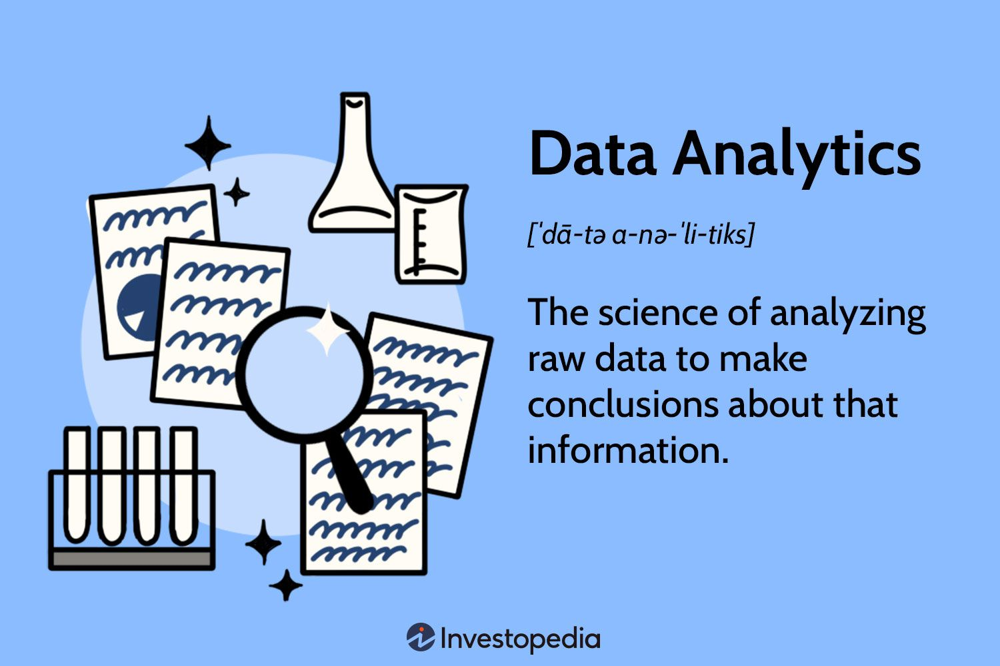

# SkilHarvest-Data-Documentation
**Documentation Outline**
- [Project Overview](#project-overview)
- [Data Sources](#data-sources)
- [Tools Used](#tools-used)
- [Data Cleaning and Preparation](#data-cleaning-and-preparation)
- [Data Analysis](#data-analysis)
- [Results and Findings](results-and-findings)
- [Tables](#tables)



## Project Overview
This Data Analysis project aims to generate insight into the sales performance of the E-commerce project over the past year. By analysing the various parameters in the data received, we seek to gether enough insight to make reasonable decisions which then enables us to tell compelling stories around our data from the insight gotten and to know the best performance from our data.

## Data Sources
The primary source of Data used is Data Sale.csv and this is open source data that can be freely downloaded from an open source online such as kaggle or FRED or any other data repository site

## Tools Used
- Ms Excel for Data Cleaning [Download Here](https://www.microsoft.com)
- SQL Server (For Querying and Analysis)
- Power BI (For Reporting)
- Ms PowerPoint (For Presentation)

## Data Cleaning and Preparation
Exploratory Data Analysis (EDA) invloves exploring the Data to answer some critical question about the Data such as:
- What is the overall sales trend
- Which product are top sellers
- What are the products on peak sales?

## Data Analysis
This is where we include some basic lines of code or queries or even some of the DAX expressions used during the analysis
```
SQL
SELECT *
FROM Table 1
WHERE A, B, C = Positive integers
```

## Results and Findings


This is where you put the insight gotten from the analysis

**bold**

*italic*

## Tables
|Heading 1 | Heading 2 | Heading 3 |
| ---------| ----------| ----------|
| Data 1 | Data 2 | Data 3 |
